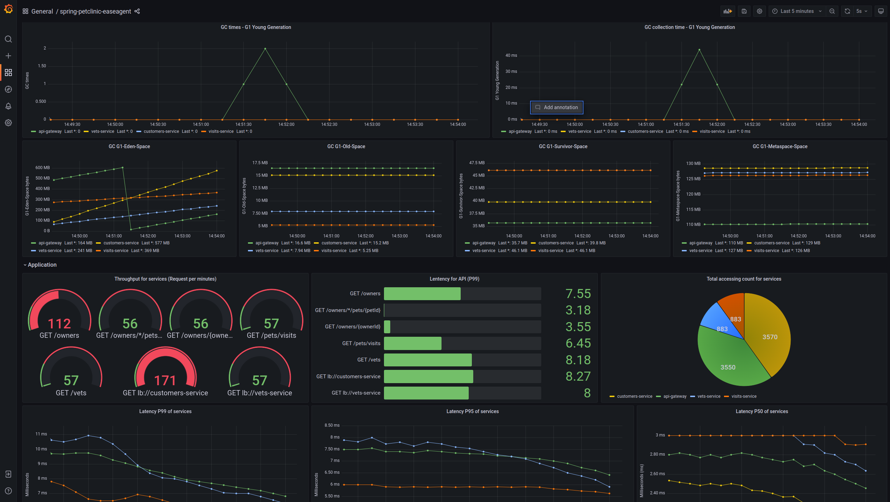
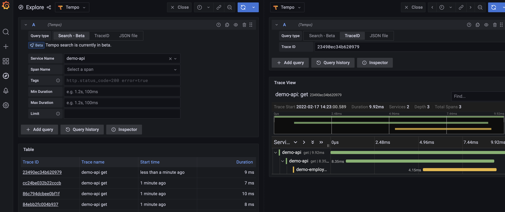

# EaseAgent-Spring-PetClinic

A repository demonstrate how to leverage the EaseAgent to monitor java applications.

- [EaseAgent-Spring-PetClinic](#easeagent-spring-petclinic)
  - [Purpose](#purpose)
  - [Quick Start](#quick-start)
    - [Prerequisites](#prerequisites)
    - [Start the full stack](#start-the-full-stack)
    - [Stop the full stack](#stop-the-full-stack)
    - [Visualization](#visualization)
  
## Purpose
With the EaseAgent, the metrics of [spring-petclinic applications](https://github.com/spring-petclinic/spring-petclinic-microservices) like throughput, latency, and tracing data could be collected prometheus and tempo. The Grafana allows us to query, visualize, on and understand our metrics that we stored in tempo and prometheus.

## Quick Start

### Prerequisites

- Make sure you have installed the docker, docker-compose in you environment.
- Make sure your docker version is higher than v19.+.
- Make sure your docker-compose version is higher than v2.+.

### Start the full stack

We leverage the docker-compose to provision the full stack service, services include:
- spring-petclinic services:
  -  `config-server`, `discovery-server`, `customers-service`, `vets-service`, `visits-service`, `api-gateway`
- `tempo` service which is dedicated to collecting the tracing data of the spring-petclinic services.
- `prometheus` service which is dedicated scrape the metrics of the spring-petclinic services.
- `grafana` service which is dedicated to visualize the metrics and tracing data.
- `loads` service which is dedicated to produce loads to all spring-petclinic services.


After you clone the repository, you need run **git submodule update --init** to update submodule, which is configuratoin of the spring-petclinic.

```shell
git submodule update --init
```


> All images in the stacks are pulled from the docker official registry. You should make sure you can pull images from it. All images are official image. **WE HAVE NOT CHANGE ANY THING OF THEM**.

Provisioning full stack command is:
```shell
./spring-petclinic.sh start
```


> The script will download the easeagent v2.0.2 release from the github release page. You should make sure you can access the internet or github. If you hard to access the github or internet, you could build easeagent from scratch, and put build target (easeagent-dep.jar) into the ` easeagent/downloaded/` directory, and rename the file name to `easeagent-v2.0.2.jar`.

### Stop the full stack

After you finished test, using following command to destroy service.

```
./spring-petclinic.sh stop
```
### Visualization

Just follow the step-by-step instructions which will guide you get a good visualization.

- Step 1. In order to get a well visualization, you could wait a moment (about to five minutes) before the prometheus collect enough metric data. Open a browser (chrome, firefox or edge is good). Input the `localhost:3000` in the address bar and press enter to open grafana UI.

- Step 2. Click the `search dashboards`, the first icon in the left menu bar. Choose the `spring-petclinic-easeagent` to open the dashboard we prepare for you.
  
- Step 3. You will get a visualization of metrics reported by the EaseAgent. In the dashboard we classified into two group. One is the JVM metrics which contain GC executing count ,GC executing time, and used memory capacity (Eden, Olden, etc...).  The second the important metrics of the application, including throughput, latency, in different measures, for example, http request throughput and latency, JDBC SQL throughput and latency.





- Step 4. If you want check the tracing data, you could click the `explore` in the left menu bar. Click the `Search - beta` to switch search mode. Click `search query` button in the right up corner, there is a list appeared contains many tracing. Chose one to click.



