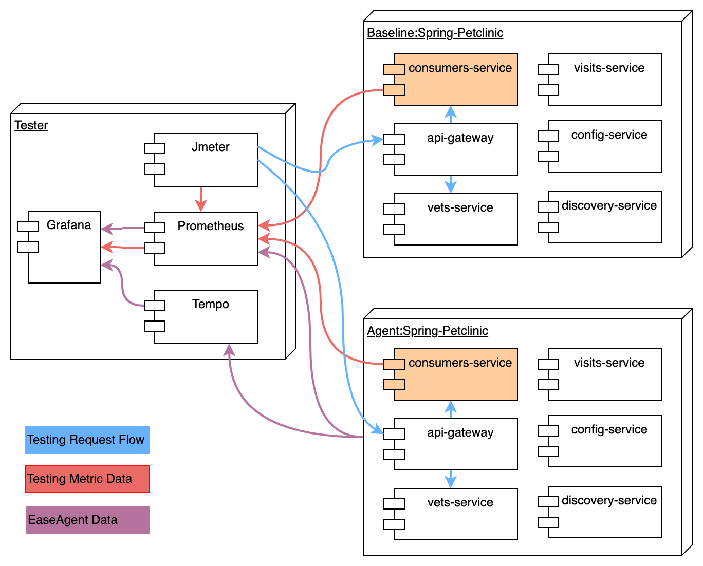
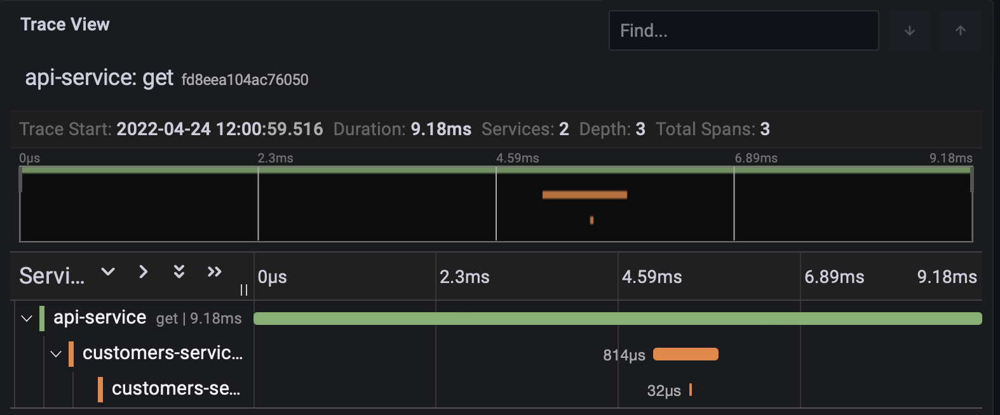
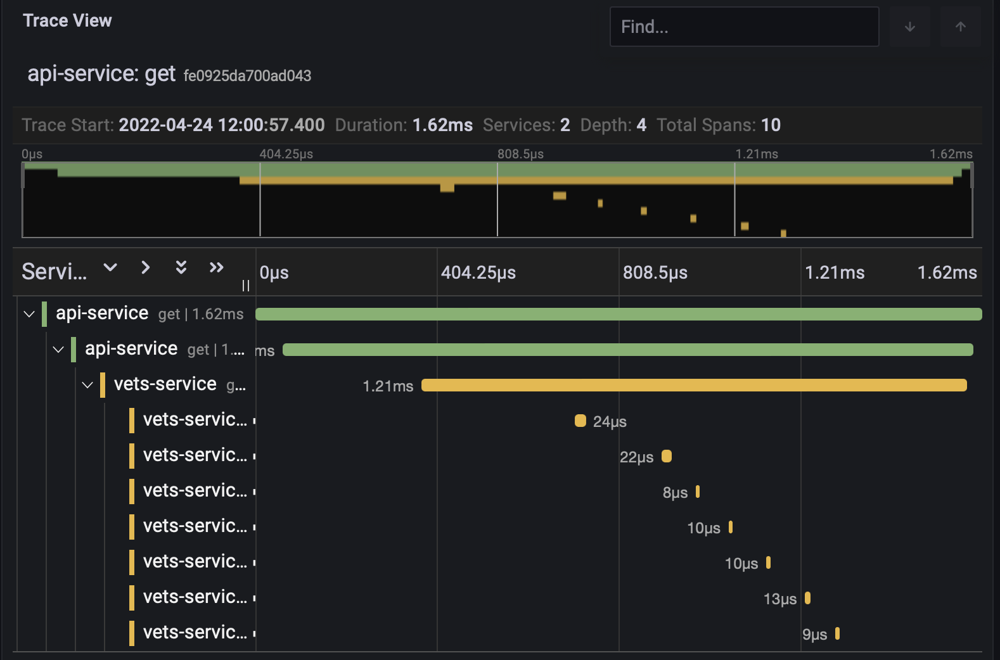
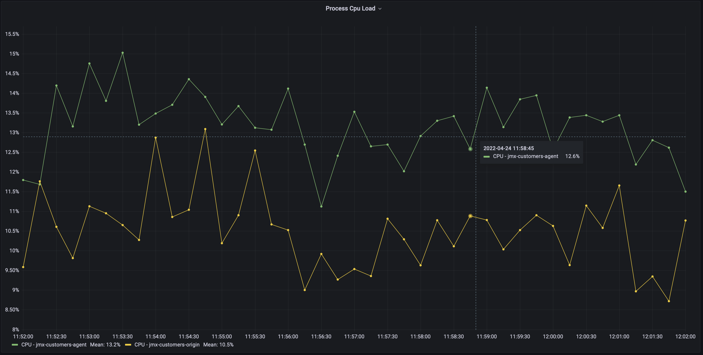
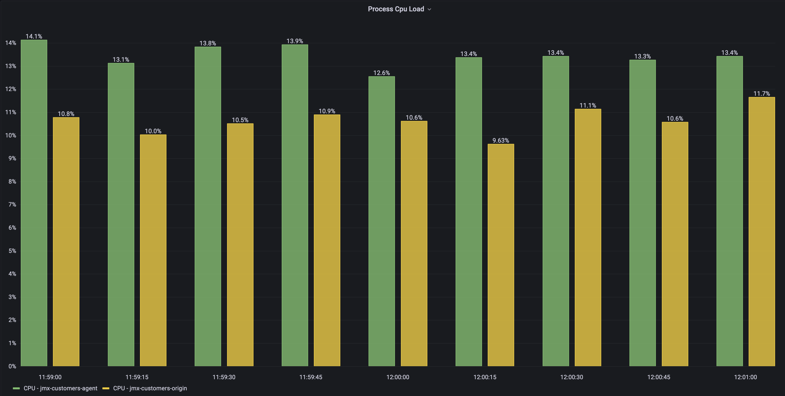
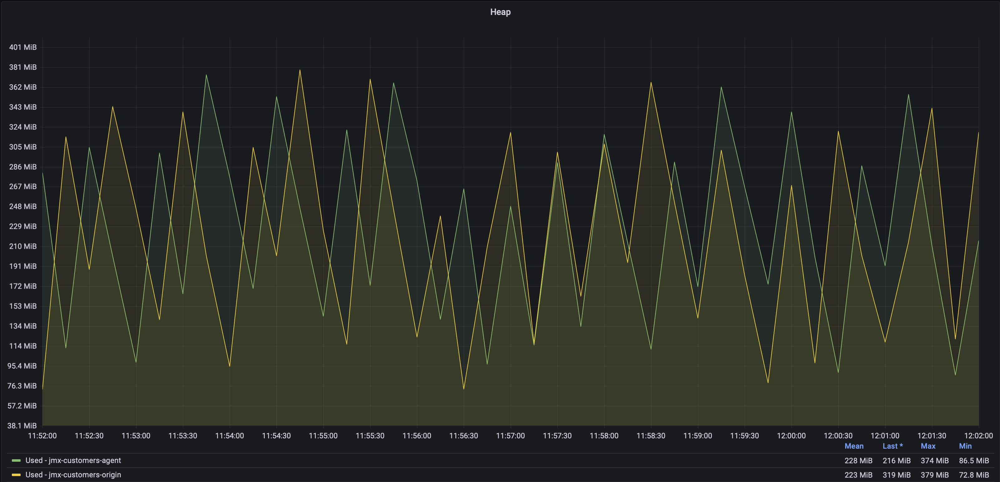
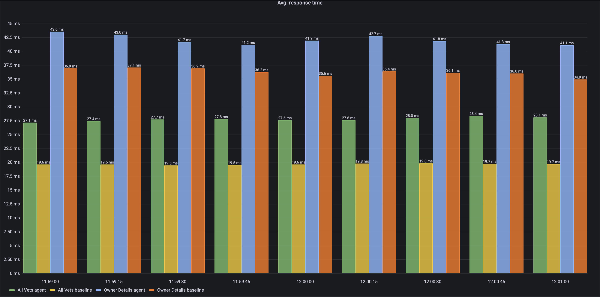
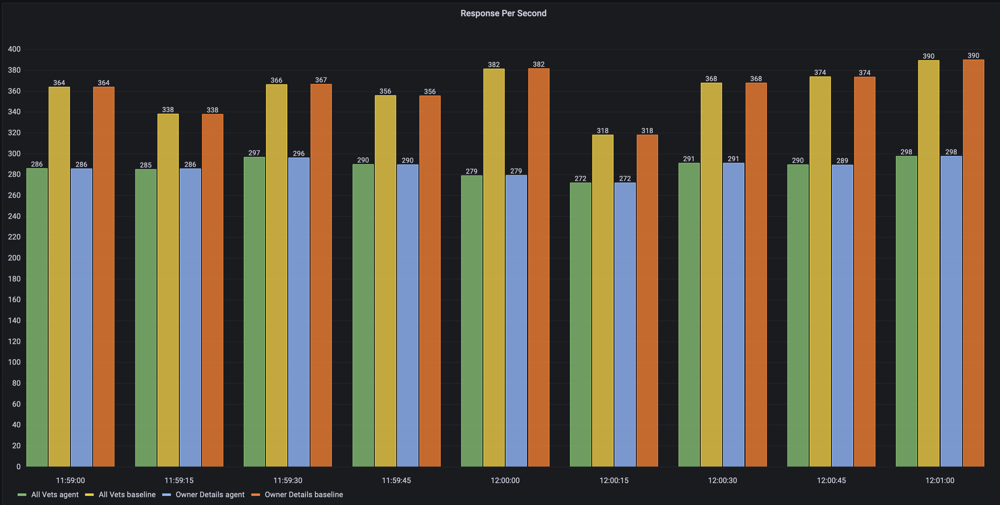

# Benchmark Test

## Testing Environment
### Application
We use [spring-petclinic applications](https://github.com/spring-petclinic/spring-petclinic-microservices) as the benchmark application because it is relatively close to the real user scenario. The application includes these services: `api-gateway`, `customers-service`, `vets-service`, `visits-service`, `config-server` and `discovery-server`.

We use three AWS EC2 machines for the benchmark test, as shown below:



- Baseline EC2: run the application with `JMX_Exporter` on `customers_service`, and without Easeagent.
- Agent EC2: run the application with `JMX_Exporter` on `customer_service`, and with Easeagent on `api-gateway`, `customers-service`, `vets-service` and `visits-service`.
- Tester EC2: run `Grafana`, `Prometheus`, `Tempo` and `Jmeter` with `Jmeter-promethues-plugin`. On this EC2, we initiate testing requests and collect testing metric data.

[JMX_Exporter](https://github.com/prometheus/jmx_exporter) exports JVM metrics, including `Process Cpu Load`(java_lang_OperatingSystem_ProcessCpuLoad), `Heap`, `GC Count` and so on.  
[Jmeter-promethues-plugin](https://github.com/johrstrom/jmeter-prometheus-plugin) exports request metrics as defined in Jmeter plan file.


### EC2
All three AWS EC2 machines have the exact same configuration, and in a subnet:
```
CPU: 2 cores, Intel(R) Xeon(R) Platinum 8175M CPU @ 2.50GHz
MEM: 7850092 kB
SSD: XFS 100G

OS: CentOS Linux release 8.5.2111
Docker version 20.10.14, build a224086
docker-compose version 1.27.4, build 40524192
```

### Configuration
The benchmark test configuration is simple, only lay in `env.sh` which exists in the project top-level directory.
```
export TESTER_IP="172.20.2.115"
export BASELINE_IP="172.20.2.138"
export AGENT_IP="172.20.2.212"
```
So, if you want to reproduce this test, just replace these three IP with yourself.


## Launch and Test


### Baseline and Agent EC2 node

We leverage the docker-compose to provision the full-stack service.

On Baseline EC2, we launch up the stack without EaseAgent, so let `EASEAGENT=""`:

```
env COMPOSER=benchmark-compose EASEAGENT="" ./benchmark.sh start 

```

On Agent EC2, we provision the stack with EaseAgent, so let `EASEAGENT="true"`:
```
env COMPOSER=benchmark-compose EASEAGENT="true" ./benchmark.sh start 

```

Then, check dockers have been started and ports have been exported:
```
# docker container ls  

CONTAINER ID   IMAGE                                                COMMAND                  CREATED       STATUS       PORTS                                                                                                                NAMES
7ab2d2edccae   springcommunity/spring-petclinic-api-gateway         "./dockerize -wait=t…"   5 hours ago   Up 5 hours   0.0.0.0:8080->8080/tcp, :::8080->8080/tcp, 0.0.0.0:9905->9905/tcp, :::9905->9905/tcp, 8081/tcp                       api-gateway
90449cc910c2   springcommunity/spring-petclinic-visits-service      "./dockerize -wait=t…"   5 hours ago   Up 5 hours   9090/tcp, 0.0.0.0:9903->9903/tcp, :::9903->9903/tcp                                                                  visits-service
293cc811f61f   springcommunity/spring-petclinic-vets-service        "./dockerize -wait=t…"   5 hours ago   Up 5 hours   8081/tcp, 0.0.0.0:9904->9904/tcp, :::9904->9904/tcp                                                                  vets-service
c1995b3e8cc4   springcommunity/spring-petclinic-customers-service   "./dockerize -wait=t…"   5 hours ago   Up 5 hours   0.0.0.0:8082->8082/tcp, :::8082->8082/tcp, 8081/tcp, 0.0.0.0:9901-9902->9901-9902/tcp, :::9901-9902->9901-9902/tcp   customers-service
31c347bb8e71   springcommunity/spring-petclinic-discovery-server    "./dockerize -wait=t…"   5 hours ago   Up 5 hours   8761/tcp                                                                                                             discovery-server
69ab01b9c066   springcommunity/spring-petclinic-config-server       "java org.springfram…"   5 hours ago   Up 5 hours   8888/tcp 
```

### Tester EC2

#### Grafana/Prometheus/Tempo
Lunch Grafana/Prometheus/Tempo by the following command:

```
env COMPOSER=benchmark-tester-compose EASEAGENT="" ./benchmark.sh start
```

Check the docker running:
```
# docker container ls 
CONTAINER ID   IMAGE                    COMMAND                  CREATED        STATUS        PORTS                                       NAMES
c3b59d3ab544   grafana/grafana:main     "/run.sh"                19 hours ago   Up 19 hours   0.0.0.0:3000->3000/tcp, :::3000->3000/tcp   grafana
a324d1ec126f   prom/prometheus:latest   "/bin/prometheus --c…"   19 hours ago   Up 19 hours   0.0.0.0:9090->9090/tcp, :::9090->9090/tcp   prometheus
bbaea31d473d   grafana/tempo:latest     "/tempo -search.enab…"   19 hours ago   Up 19 hours   0.0.0.0:9411->9411/tcp, :::9411->9411/tcp   tempo

```

#### Start Jmeter

For we leverage the `Jmeter-prometheus-plugin` to export the request/response metrics, we should install the [Jmeter Plugin Manager](https://jmeter-plugins.org/wiki/PluginsManager/), and then install the `Prometheus Listener Plugin` in the available plugins list of the Plugin Manager, or install all required plugins by put plugin jars into the `lib/ext`.
And before starting the test, the destination IP in the JMX file should be changed to the actual IP.

```          <collectionProp name="UserParameters.thread_values">
            <collectionProp name="1887838014">
              <stringProp name="-1720785339">baseline</stringProp>
              <stringProp name="50">2</stringProp>
              <stringProp name="50">2</stringProp>
              <stringProp name="1463952332">172.20.2.138</stringProp>
              <stringProp name="1716208">8080</stringProp>
            </collectionProp>
          </collectionProp>
        
          ......
        
          <collectionProp name="UserParameters.thread_values">
            <collectionProp name="1728680715">
              <stringProp name="92750597">agent</stringProp>
              <stringProp name="50">2</stringProp>
              <stringProp name="50">2</stringProp>
              <stringProp name="1463953225">172.20.2.212</stringProp>
              <stringProp name="1716208">8080</stringProp>
            </collectionProp>
          </collectionProp>
```

Then, we start the testing in non-GUI mode.

```
export PATH_TO_JMETER="You_Path_of_Jmeter"
export PATH_TO_THIS_PRJ="You_Path_of_This_PRJ"

# $PATH_TO_JMETER/bin/jmeter -n -t $PATH_TO_THIS_PRJ/jmeter/benchmark-simple-20t-1200s.jmx -l ./t20.result.jtl

```

After starting the test, we can access the testing data via Grafana's `jmx_exporter_dashboard`.

## Test Result
We start two identical threads groups to access the `Baseline` and `Agent` node at the same time, and last for 20mins, and Focus on the data of the period that is 5 minutes after the start of the test and 2 minutes before the end of the test.

We test two URIs that have different SPANS:
- api/gateway/owners/2, has 3 spans, using the `Owner Details` label. 
- api/vet/vets, has 10 spans, using the `All Vets` label.

Tracing of the `Owner Details`

Tracing of the `All Vets`



### 20threads test for 20mins

From the Grafana dashboard, we get the `CPU Load` and `Heap`, `Latency` and `Throughput` data.

#### CPU
Easeagent's impact on Process CPU Load is between 2 %and 3%.



#### Heap
Easeagent has a very small impact on heap space memory.


#### Latency and Throughput
Easeagent has an excessive impact on latency and throughput and is positively correlated with the number of Spans.




## Conclusion
The bottleneck of Easeagent is mainly in latency and throughput, which requires optimization of the asynchronous processing module, such as introducing a lock-free mechanism.


